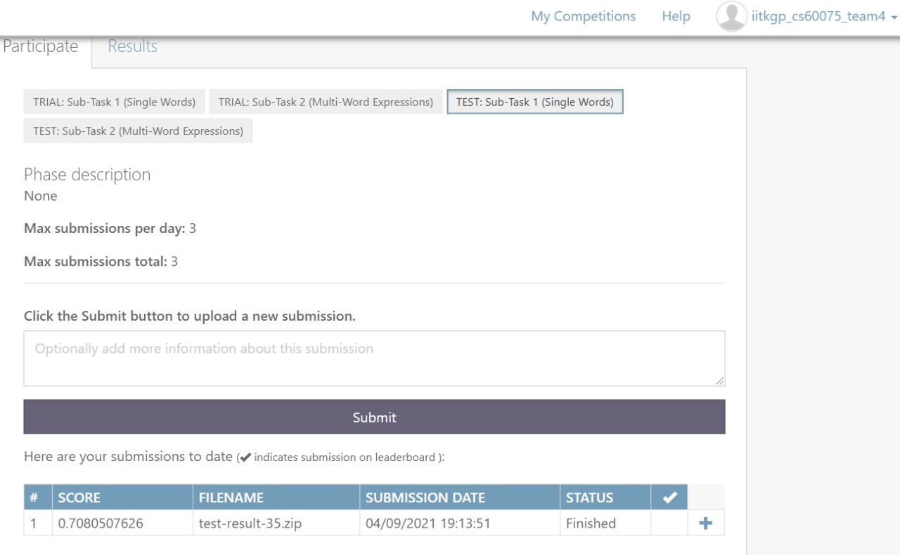
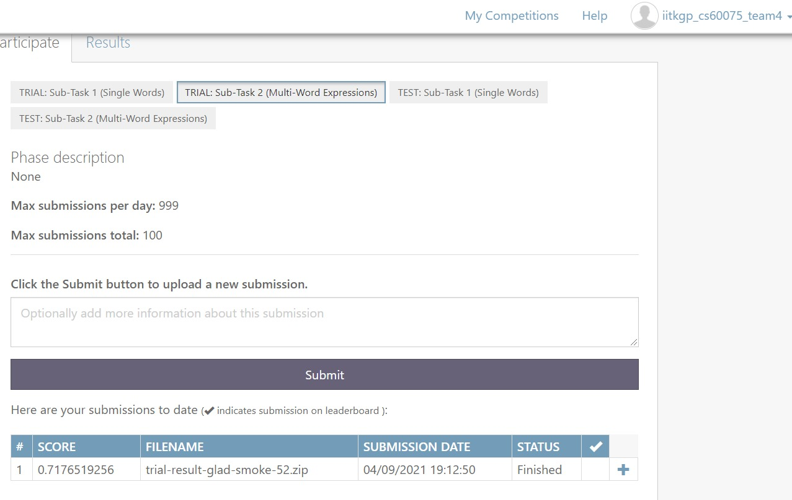
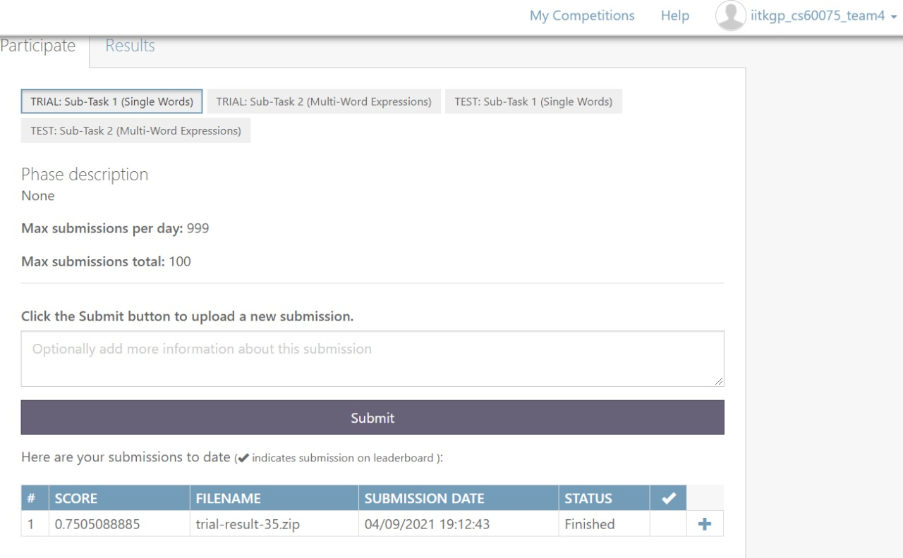

# NLP Term Project Spring 2021 Team 4

Course Project for CS60075: Natural Language Processing

Working on SemEval 2021 (Task 1): [LCP Shared Task 2021](https://sites.google.com/view/lcpsharedtask2021)

Lexical complexity plays a crucial role in reading comprehension. Predicting lexical complexity accurately can enable a system to better guide a user to an appropriate text, or tailor a text to their needs. NLP systems have been developed to simplify texts for second language learners, native speakers with low literacy levels, and people with reading disabilities.

The dataset provided is an augmented version of CompLex, a multi-domain English dataset with sentences annotated using a 5-point Likert scale (1-5) described in [Shardlow et al. (2020)](https://arxiv.org/pdf/2003.07008.pdf). The task is to predict the complexity value of words in context.

Likert Scale: The complexity scores (1-5) in LCP 2021 correspond to the following:

1. Very Easy: Very familiar words: mapped to 0
2. Easy: An annotator was aware of the meaning: mapped to 0.25
3. Neutral: Neither difficult nor easy: mapped to 0.5
4. Difficult: Words for which an annotator was unclear of the meaning, but may have been able to infer the meaning from the sentence: mapped to 0.75
5. Very Difficult: Words that an annotator had never seen before, or were very unclear: mapped to 1

LCP 2021 has the 2 sub-tasks:
1. Sub-task 1: predicting the complexity score of single words
2. Sub-task 2: predicting the complexity score of multi-word expressions

# Deliverables
The data used in the code provided can be downloaded from [Google Drive](https://drive.google.com/drive/u/2/folders/1VcfuOHGu9OMn0qpjFw70fEmJ4pAjSfIa).

The instructions to run the code on a local setup has been specified in instructions.txt.

The code can also be run on Google Colab, where it has been setup. Link to the [Colab Notebook](https://colab.research.google.com/drive/15wGcIhXM_NNy6PNa-xLN6lBTnKU0zECJ?usp=sharing)

The brief presentation video is uploaded on Google Drive. [Link](https://drive.google.com/drive/folders/1r0LDocuY7C9kLta4itgJ4jdRVe7TrSyk?usp=sharing)

# Codalab Submissions
## Test Subtask-2

## Test Subtask-1

## Trial Subtask-2

## Trial Subtask-1

